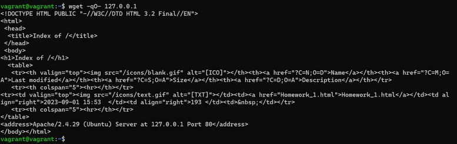
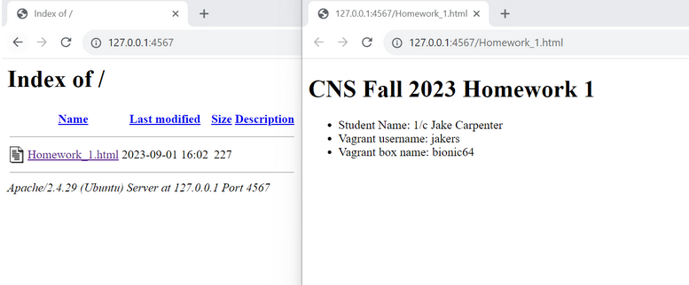

# Homework 1
1/c Jake Carpenter

## Provisioning the Machine

To provision the VM I started by creating my HTML directory and placing the homework.html file in it. Then I wrote the bootstrap.sh file in the box's directory, and then downloaded and installed the new box
onto my VirtualBox. I changed the code inside the VagrantFile to run the bootstrap, then ran the box. I then called the HTML inside the box.

## Configuring the Network

I went inside my VagrantFile and wrote out the new line of code telling the box where and how to host the HTML. I then reloaded my box, and was able to access my HTML file.

## Shell Provisioner

The Shell Provisioner is a good provisioner for beginners who are experimenting with a provisioner and do not need a significant amount of customization, or those that only have a simple goal. 
Shell uses scripts with SSH for POSIX machines (and machines similar to POSIX); and it uses Powershell and Batch scripts through WinRM for Windows guest machines. You begin using the Shell
Provisioner with either and Inline or External script, both of which take arguments needed for customization.
