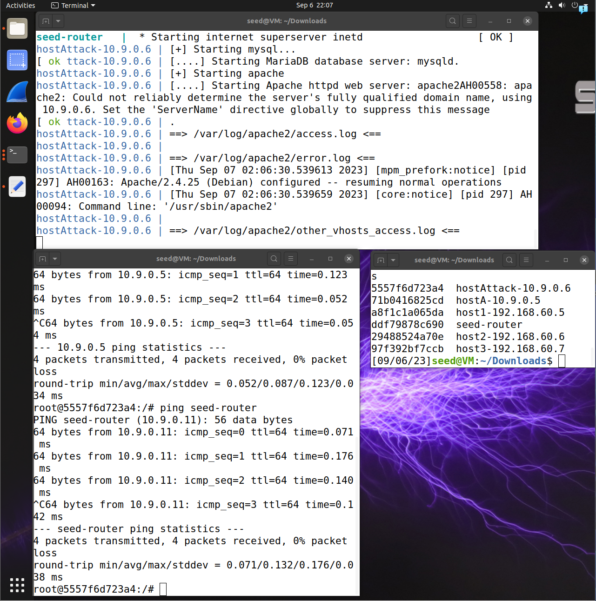

# CNS Homework 2
1/c Jake Carpenter,
07SEP23

## Two Containers: datadog/agent, cimg/ruby

The developers of datadog/agent are Datadog. Datadog is a program that compiles all of your data collections into one accessable area. The aim is to make your data more digestable and easy to find. There are not many options available on the container due to the software being fairly proprietary, however, there are many tags that can be used for it. This container is unique because is made specifically to run the Datadog software.

Tbe developers of cimg/ruby are CircleCl. It contains the Ruby programming language, which has the "gem" command. This is bascially a container focused on running the company's proprietary coding language. The options include running the browser variant, adding variant tags, clone your Git submissions, etc. This is unique because it is built to run the company's custom language.

## My Container: vulnerables/web-dvwa

The purpose of this container is to be as vulnerable as possible, so newcomers to cybersecurity and pentesting are able to learn in a safe and controlled enviornment. The only real options you have while running the container are resetting the environment or changing the difficulty. This is unique because the container is meant to be abused by the user for training, not typically what many containers on dockerhub would prefer.

