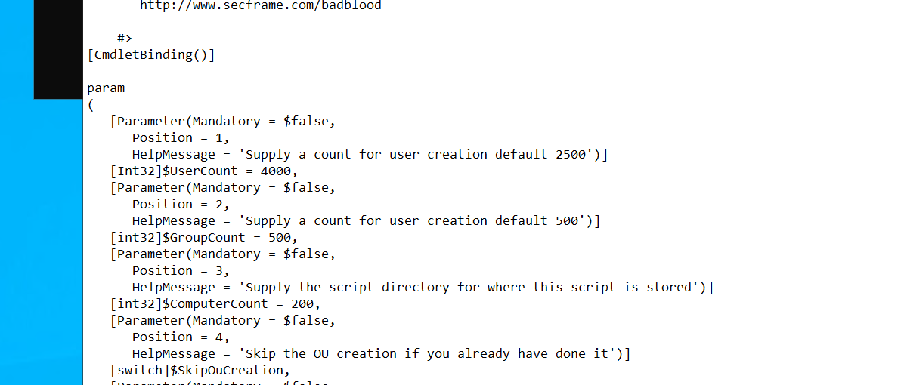

# Homework 4
1/c Jake Carpenter, CNS, 7SEP23

## Part 2

The following are all of our newly created accounts. The screenshots show their "Member Of" and "Accounts" tabs.

## Part 3

The following are all the information surrounding me logging onto my newly created domain user account.

## Part 4.1

The screenshot shows the status of our execution policy. The policy that we chose was "Bypass." We chose this because it gave us the most freedom and least errors when running our future programs. 

## Part 4.2

The screenshot above is the really cool script that I ran :O

## Part 4.3

In our DC enviornment, we decided that BadBlood needed to give us 4000 new users, 500 new groups, and 200 new computers. We ran into little errors when we ran this. There were a lot of new people added to it.

