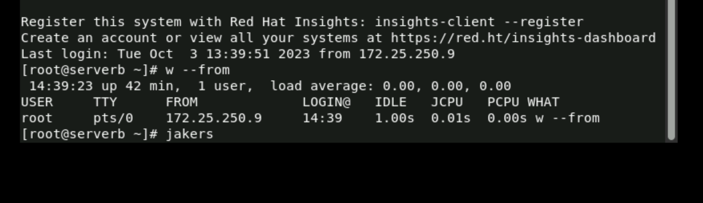
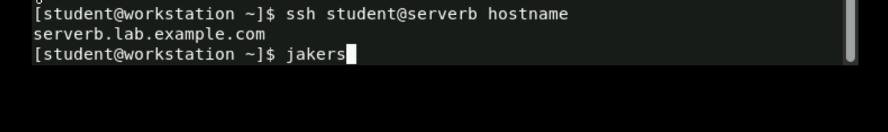
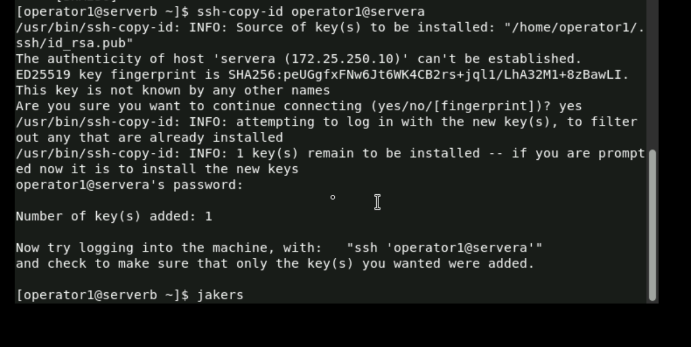
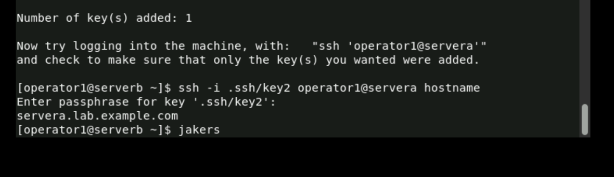
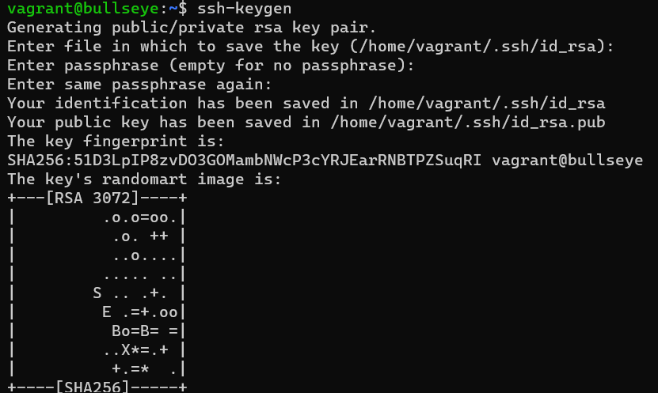
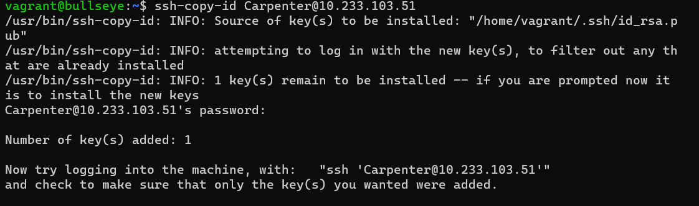
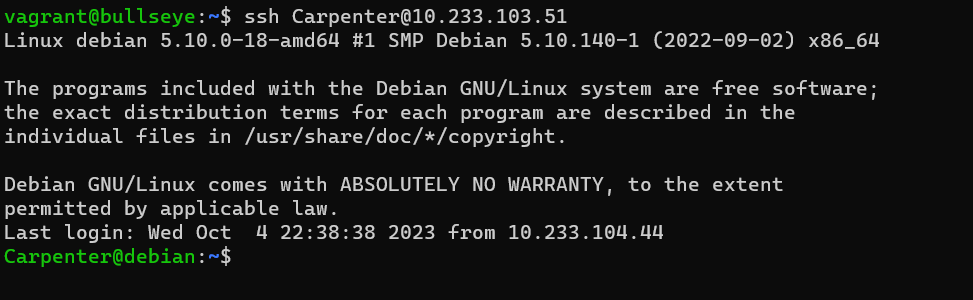
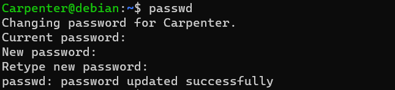
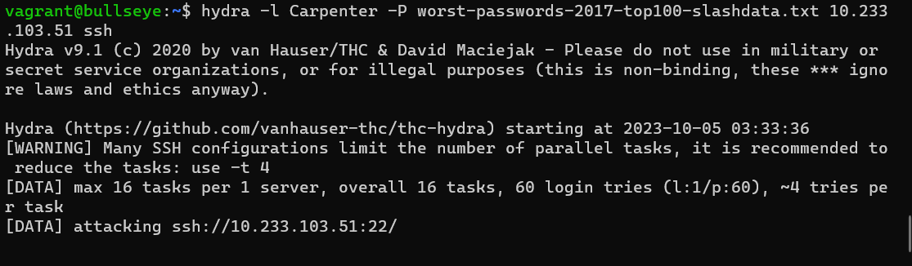
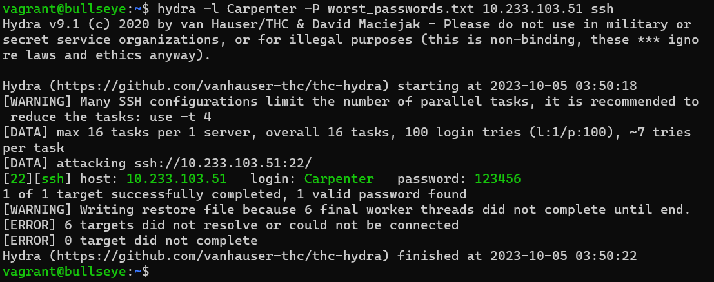

## Homework 5
1/c Jake Carpenter, CNS, 05OCT23

## Part 2

Step 6 of 10.2:

Step 12 of 10.2:

Step 4 of 10.4:

Step 9 of 10.4:

## Part 3

I downloaded a linux virtual box to do the assignment in. I generated my SSH keys in it before I SSHed into my Jump Box.

I copied my public key into my Jump Box from my VM.

I was able to log into my Jump Box without having to type in my password.

## Part 4

I changed my password on my Jump Box to a password in the top 100 (123456).

I installed Hydra on my VM and ran the program. I attempted to download the reccommended text file, but I was having a bunch of issues getting Hydra to run with it. So I created a new text file titled "worst_passwords.txt," copied all the passwords in the original list, and ran that in Hydra instead.

I successfully brute-forced the password.
