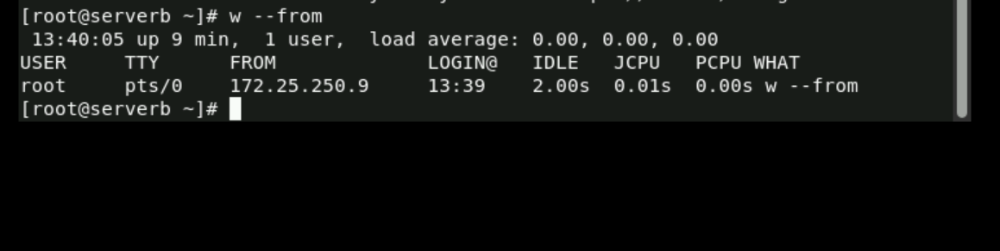
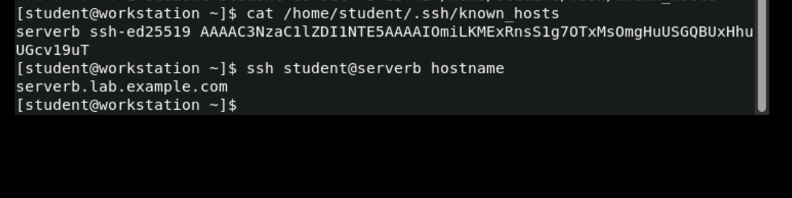
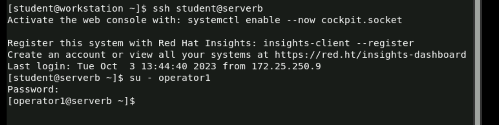
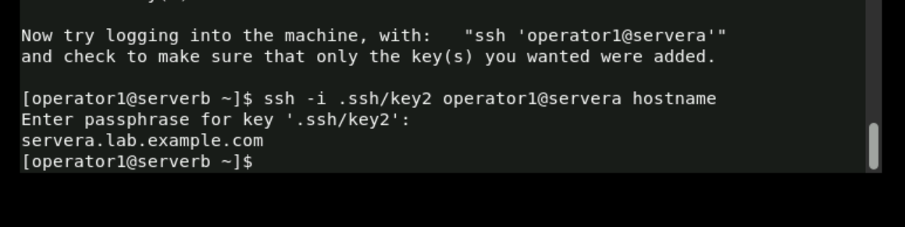

## Homework 5
1/c Jake Carpenter, CNS, 05OCT23

## Part 2

Step 6 of 10.2:

Step 12 of 10.2:

Step 4 of 10.4:

Step 9 of 10.4:

## Part 3

I downloaded a linux virtual box to do the assignment in. I generated my SSH keys in it before I SSHed into my Jump Box.

I copied my public key into my Jump Box from my VM.

I was able to log into my Jump Box without having to type in my password.

## Part 4

