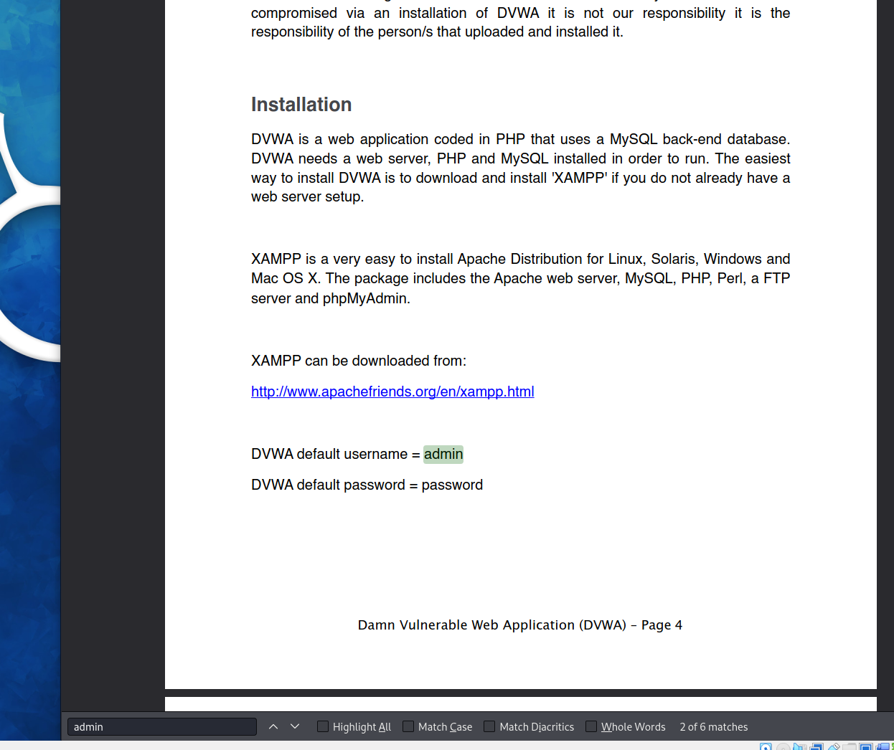

# Homework 8
1/c Jake Carpenter, CNS, 16NOV2023

## Part 2

The tool that I used and researched was Gobuster. Gobuster is a tool used for brute-forcing website URLs to find directories, files, and subdomains. You can request which types of files you want Gobuster to report back to you with, and which website to brute-force. Gobuster takes a while to complete, but it is a thorough program which gives a significant amount of information. Gobuster comes pre-installed on ParrotOS, accessible from the drop-down menu on the top under "Pentesting" and "Most Used Tools." Although it does not automatically come with Kali, you can easily install Gobuster by typing it into the terminal. Gobuster uses the HTTP protocol and gives the user the status code of each reported object (i.e. 200, 403, etc). Gobuster has official Kali documentation; but its origin is on a Github repository created by a user named OJ Reeves. 

## Part 3 (Demo)

When I started the homework, I realized I needed to set up a Web Application on my network that I could break into. So I installed a Vagrant Box which came pre-installed with Damn Vulnerable Web Application. After I fully configured it to get off of the local host, and connect onto our network, I verified that all the hosts and VMs I had could connect to it.

I was able to open the webpage on my Kali machine. It took me to a login page.

I could also open the webpage on my AD (it also worked on my ParrotOS machine). 

I ran Gobuster to see what information I could access to get through this login page. I used a wordlist that came pre-installed with Kali. I searched for .php and .txt files. After forever, my search was done and I got a bunch of results back. The most promising lead was to open up the docs directory.

When I opened that URL, I had two files. I opened the PDF.

The PDF attached was the official documentation for the web application.

I searched up "admin" to see if there were any default credentials I could log in with. Luckily, I quickly found them.

It worked! I was able to log into the webpage using the default credentials.
